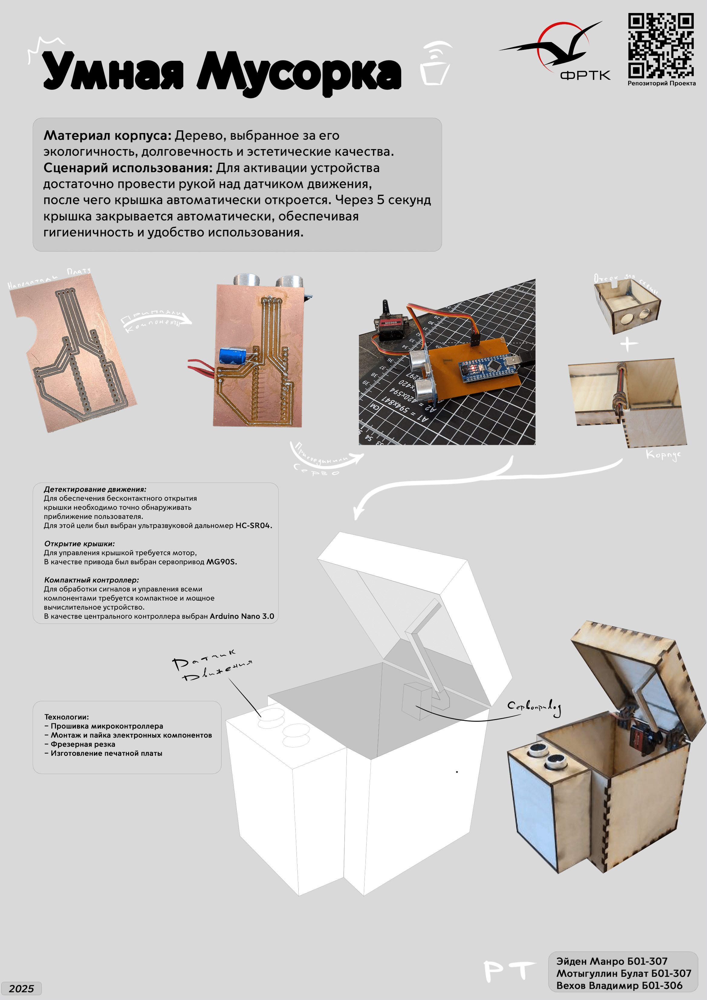
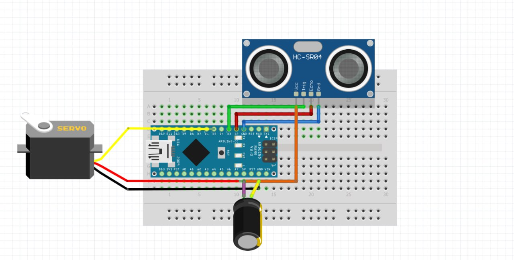
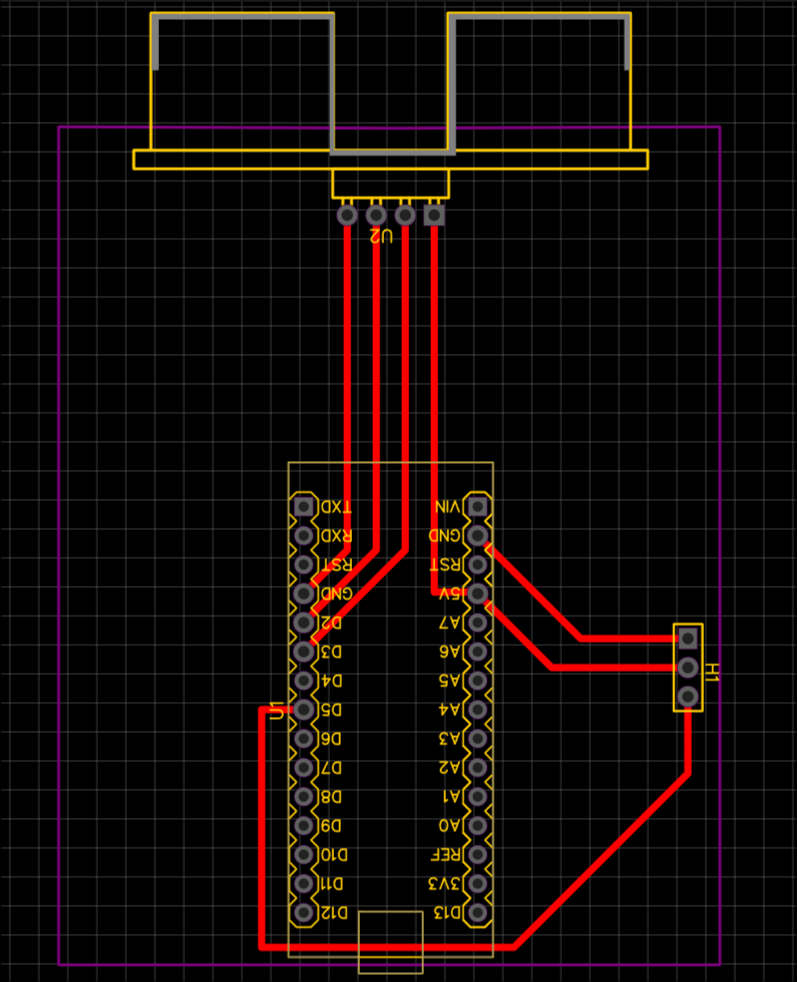
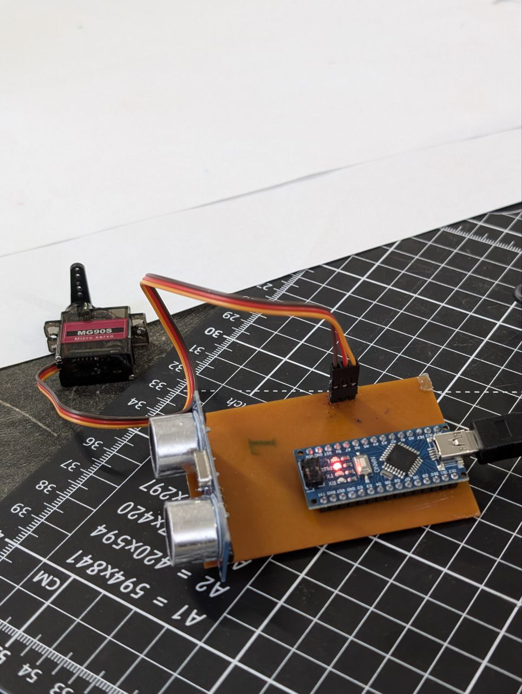
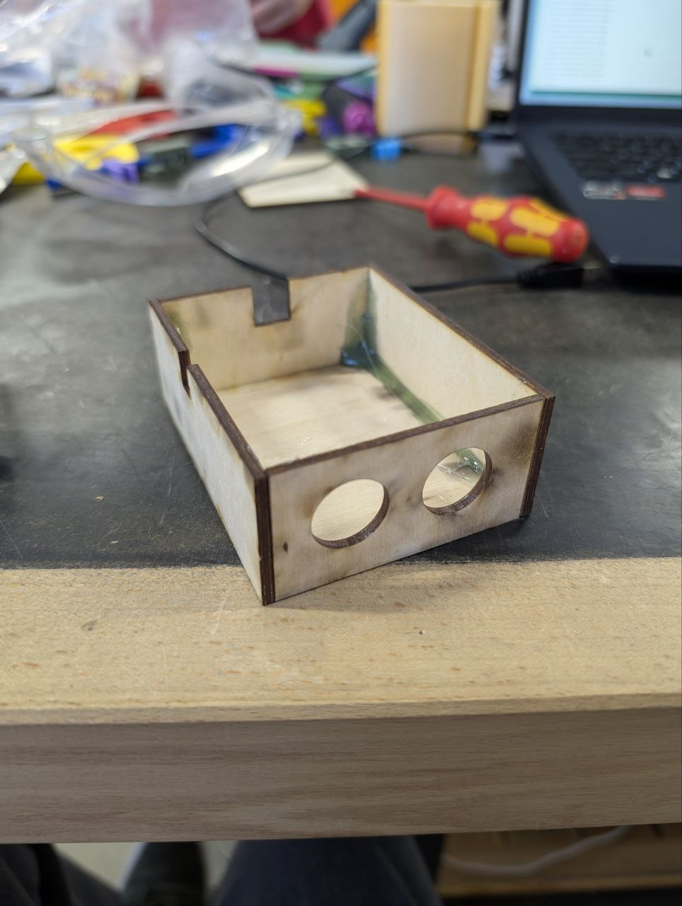
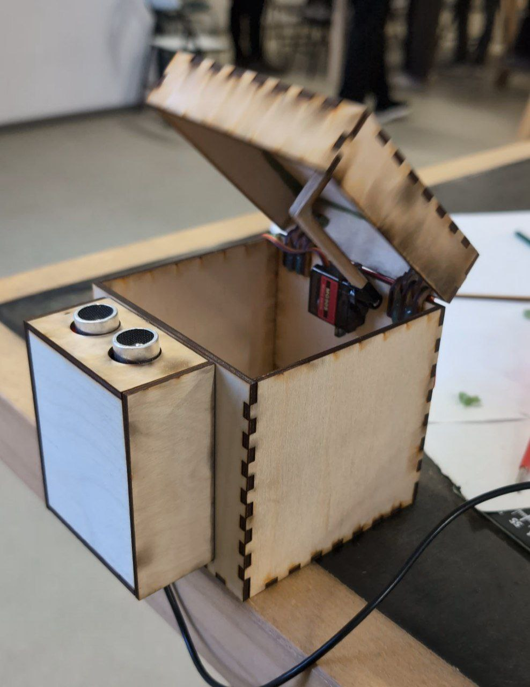

# Smart Bin
Проект умной мусорки.

Сделан для курсов "Практикум по цифровому производству" и "Микроконтроллеры" в МФТИ ФРКТ 4 семестр.

**Команда:**
- Манро Эйден Б01-307
- Мотыгуллин Булат Б01-307
- Вехов Владимир Б01-306

**Медиа:**
- [GitHub](https://github.com/aidenfmunro/SmartBin)
- [Telegram](https://t.me/smartbinmipt)

## Цель
Разработать компактную и гигиеничную мусорку с автоматическим открытием, обеспечивающую удобный доступ к утилизации отходов в любом рабочем пространстве и предотвращающую скопление мусора вокруг.

## Задачи
- Разработать концепцию устройства и подобрать необходимые компоненты
- Спроектировать и изготовить печатную плату
- Смонтировать и припаять компоненты на плату
- Спроектировать и изготовить корпус
- Выполнить окончательную сборку устройства
- Подготовить техническую и презентационную документацию проекта

## Описание устройства
- **Размеры устройства:** 20 x 25 x 20 см
- **Материал корпуса:** Дерево, выбранное за его экологичность, долговечность и эстетические качества.
- **Сценарий использования:** Для активации устройства достаточно провести рукой над датчиком движения, после чего крышка автоматически откроется. Через 5 секунд крышка закрывается автоматически, обеспечивая гигиеничность и удобство использования.

## Разработка концепции устройства и подбор необходимых компонентов

Умная мусорка решает несколько ключевых задач:

- **Детектирование движения:** Для обеспечения бесконтактного открытия крышки необходимо точно обнаруживать приближение пользователя. Для этой цели был выбран ультразвуковой дальномер HC-SR04, который позволяет эффективно измерять расстояние с высокой точностью и при этом является недорогим и простым в использовании.
- **Открытие крышки:** Для управления крышкой требуется мотор, который обеспечит надёжное и быстрое открытие при минимальных энергозатратах. В качестве привода был выбран сервопривод MG90S. Этот сервопривод сочетает в себе компактные размеры, высокую мощность и энергоэффективность, что идеально подходит для нашего устройства.
- **Компактный контроллер:** Для обработки сигналов и управления всеми компонентами требуется компактное и мощное вычислительное устройство. В качестве центрального контроллера выбран Arduino Nano 3.0, который отличается малым размером, хорошей совместимостью с различными модулями и широким сообществом поддержки, что упрощает разработку и отладку проекта.

## Проектирование и изготовление печатной платы

После первоначального тестирования компонентов на макетной плате мы спроектировали печатную плату в Easy EDA и напечатали её.

### Cхема платы в Fritzing

### Печатная плата, спроектированная в Easy EDA

### Монтаж и припайка компонентов

Собрали итоговую схему на изготовленной плате.

### Проектирование и изготовление корпуса

Также подготовили отсек для платы

### Спроектировали, изготовили деревянный корпус, cобрали все воедино

## Анализ аналогов

**Коммерческие аналоги:**

- **Мусорное ведро Daris** (1800~руб.) — объём 12~л. Устройство ориентировано на офисное использование, обладает значительными габаритами и неудобно в использовании на рабочем столе.

- **Сенсорное бесконтактное ведро Pioneer** (7500~руб.) — объём 42~л. Значительно дороже и также не предназначено для настольного применения из-за крупных размеров.
\end{itemize}

Большинство коммерческих решений обладают избыточным объёмом — минимальный найденный вариант имел объём 9~л. В контексте портативности и удобства эксплуатации на рабочем месте ни одно из устройств не может сравниться с нашим решением.

### Open-source решения

Наш проект ориентирован на DIY-подход и предоставляет возможности для модификации и адаптации под конкретные нужды пользователя. Среди аналогичных open-source проектов можно выделить:

- **Smart Trash Can от AlexGyver** — реализует схожую концепцию с использованием Arduino и ультразвукового датчика расстояния.
- **DIY Smart Trash Bin на Instructables** — проект с применением микроконтроллера ESP8266 для организации Wi-Fi подключения.

Таким образом, наш проект сочетает в себе компактность, доступность, а также открытость к доработке и кастомизации.

## Тестирование продукта

В процессе тестирования была выявлена конструктивная проблема в механизме открывания крышки. Жёсткая связь между сервоприводом и крышкой оказалась неэффективной из-за несовпадения осей вращения, что вызывало ограничение хода и нестабильную работу привода. Проблема была решена путём замены жёсткого соединения на гибкий элемент, компенсирующий разницу в траекториях движения.

## Выводы
По результатам эксплуатации устройства в повседневных условиях можно сделать следующие выводы:

- Механизм работает стабильно, без зависаний и сбоев.
- Программное обеспечение функционирует корректно, утечек памяти не наблюдается.
- Устройство не перегревается, его температура остаётся в пределах комнатной.
- Скорость реакции на жесты стабильна и не снижается со временем.
- Энергопотребление устройства остаётся на низком уровне, что обеспечивает продолжительную автономную работу при питании от ноутбука или внешнего аккумулятора.

